<p align="center">
  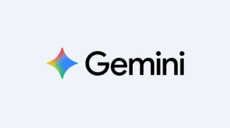
</p>

<h1 align="center">🥽 NeuroGraph LIVE</h1>

<h3 align="center"><em>From Static Chatbots to Immersive Spatial Knowledge — Powered by Gemini 2.5</em></h3>

<p align="center">
  <a href="https://frontend-ycvllulvwq-uc.a.run.app/"></a>
  <a href="https://backend-1028723285344.us-central1.run.app"></a>
</p>

<p align="center">
  
  
  
  
  
  
  
  
</p>

---

## 📺 See It In Action

> **NeuroGraph LIVE** transforms how students learn by converting fragmented textbook knowledge into **interactive 3D mind maps** with a **real-time AI tutor** that can **see**, **hear**, and **teach** — all deployable in VR with just a Google Cardboard headset.

<table>
  <tr>
    <td width="60%">
      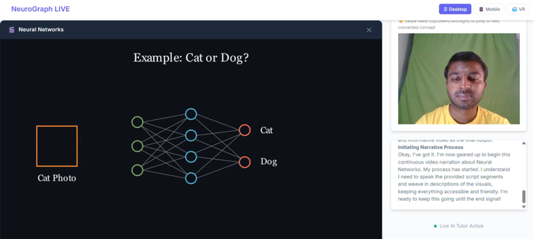
      <p align="center"><strong>🎬 Manim Animation Engine</strong> — AI generates & narrates custom educational videos in real-time</p>
    </td>
    <td width="40%">
      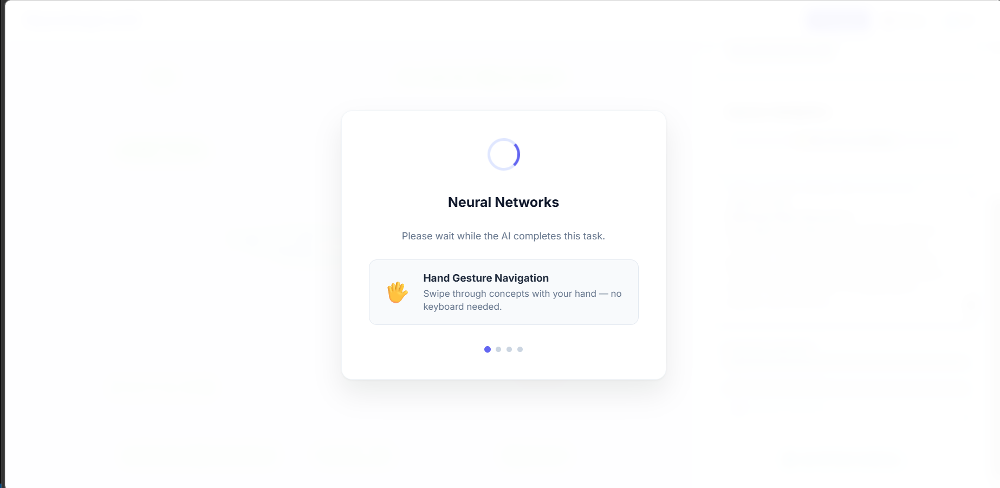
      <p align="center"><strong>⏳ Intelligent Loading</strong> — Hand gesture tips while the AI builds your graph</p>
    </td>
  </tr>
</table>

---

## 🌟 Why NeuroGraph LIVE?

### The Problem
Many students suffer from **"fragmented learning"** — collecting facts without understanding how concepts interconnect. Traditional chatbots provide linear answers, but real understanding needs **spatial context**.

### Our Solution
A **spatial knowledge navigator** that creates a **visual digital twin of knowledge**, where:

| 🔗 Connect the Dots | 🗣️ Learn by Speaking | 🥽 Immerse Yourself |
|:---:|:---:|:---:|
| See literal links between "Neural Networks" ↔ "Gradient Descent" ↔ "Backpropagation" | Talk naturally & show textbook pages to your AI tutor via camera | Enter VR mode and navigate your knowledge graph with hand gestures |

---

## 🚀 Feature Showcase

### 1. 🧠 Interactive 3D Knowledge Graph

Concepts are **semantically clustered** using Vertex AI embeddings and projected into 2D/3D space using UMAP dimensionality reduction. Click any node to explore its connections.

<table>
  <tr>
    <td width="50%">
      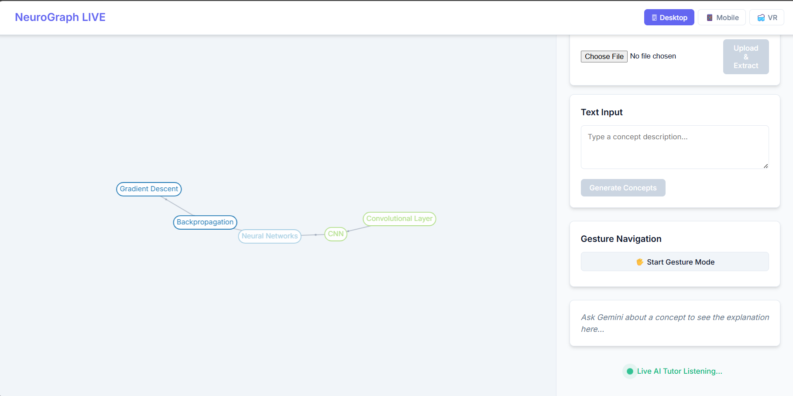
      <p align="center"><strong>Desktop View</strong> — Graph with semantic clustering, text input, and file upload</p>
    </td>
    <td width="50%">
      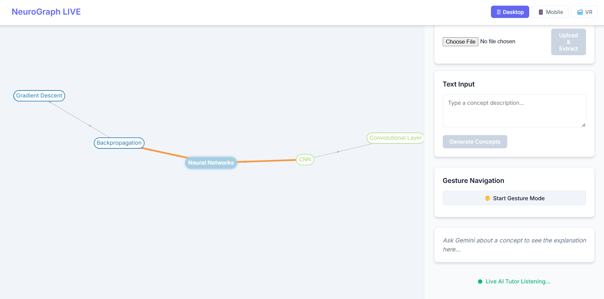
      <p align="center"><strong>Node Exploration</strong> — Click to highlight connections with color-coded edges</p>
    </td>
  </tr>
</table>

---

### 2. 🤖 Multimodal Live AI Tutor (Gemini 2.5 Flash)

The core of NeuroGraph is a **bidirectional streaming connection** to Gemini's Multimodal Live API. The AI tutor can simultaneously:

- 🎤 **Hear you** — Real-time speech recognition via native audio streaming
- 👁️ **See you** — Camera frames sent as visual "heartbeats" every 2 seconds
- 📖 **Read your textbook** — Point your camera at a page and the AI extracts & maps concepts
- 🗺️ **Build your graph** — Proactively appends new nodes/edges to your existing knowledge map

<p align="center">
  
  <br/>
  <em>The AI tutor analyzes camera input, generates a Manim animation for "Neural Networks," and narrates it live.</em>
</p>

---

### 3. 🥽 VR & Mobile Immersion

<table>
  <tr>
    <td width="35%">
      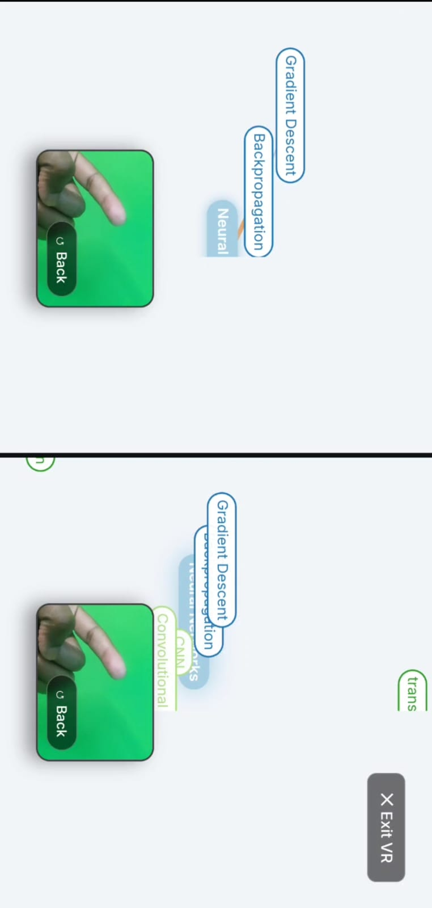
      <p align="center"><strong>📱 VR Mode</strong> — Stereoscopic split-screen with live hand gesture detection via camera</p>
    </td>
    <td width="35%">
      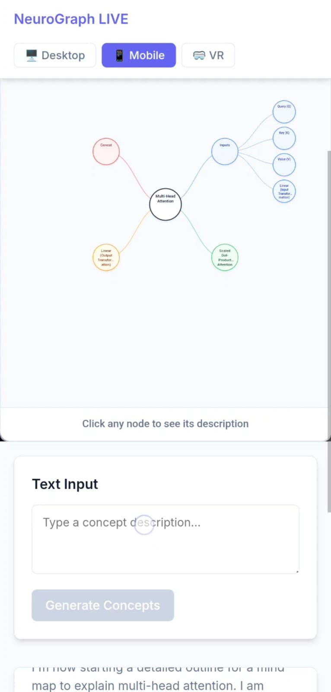
      <p align="center"><strong>📲 Mobile View</strong> — Full responsive UI with touch interactions and concept generation</p>
    </td>
    <td width="30%">
      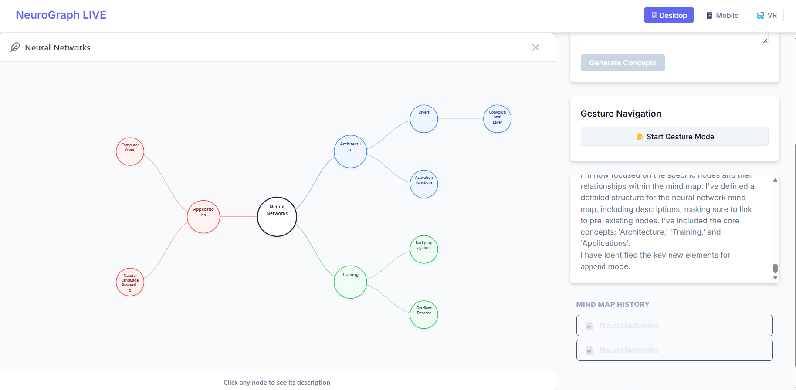
      <p align="center"><strong>🧩 Deep Mind Maps</strong> — Multi-level concept trees with AI-generated descriptions and history tracking</p>
    </td>
  </tr>
</table>

**VR Features:**
- ✅ Google Cardboard compatible stereoscopic rendering
- ✅ Hand gesture navigation (swipe through nodes without controllers)
- ✅ Camera-based hand detection using the device's front camera
- ✅ VR-optimized overlays for quizzes, videos, and mind maps

---

### 4. 🎬 Dynamic Manim Education Engine

Ask *"Show me how this works"* and the system:

1. **Gemini 2.5 Pro** writes a custom Manim (Python) animation script
2. The backend renders the animation to **MP4** in real-time
3. The video is streamed back and **narrated live** by the AI tutor
4. Stored in **Google Cloud Storage** for future playback

---

### 5. 🌐 Multilingual Support

NeuroGraph's AI tutor powered by Gemini supports **multilingual conversations**:

- 🗣️ Speak in **any language** — the tutor understands and responds naturally
- 📝 Generate concept graphs in your **preferred language**
- 🌏 Break language barriers in education — accessible worldwide

---

## 🏗️ System Architecture

<p align="center">
  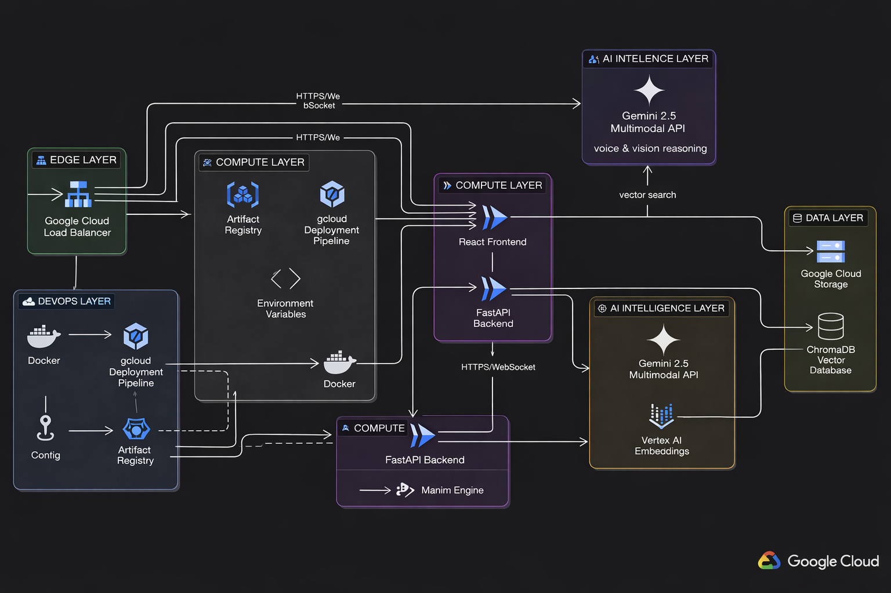
</p>

<details>
<summary><strong>📋 Architecture Breakdown (Click to expand)</strong></summary>

| Layer | Technology | Purpose |
|:---:|:---:|:---|
| **Edge Layer** | Google Cloud Load Balancer | Traffic distribution & SSL termination |
| **Compute Layer** | Cloud Run (Auto-scaling 0→3) | Serverless containers for frontend & backend |
| **DevOps Layer** | Docker + Artifact Registry + gcloud CLI | CI/CD pipeline & container management |
| **AI Intelligence** | Gemini 2.5 Flash (Live API) | Real-time bidirectional audio/vision streaming |
| **AI Reasoning** | Gemini 2.5 Pro | Complex Manim script generation |
| **Vector Search** | Vertex AI `text-embedding-004` | Semantic embedding for concept clustering |
| **Data Layer** | Google Cloud Storage + ChromaDB | MP4 storage & vector database |
| **Frontend** | React + Vite + D3.js | Interactive 3D knowledge graph UI |
| **Backend** | Python + FastAPI + WebSocket | Multimodal Hub & Manim engine |

</details>

---

## 🛠️ Technology Stack & Google Cloud Integration

This project is built **end-to-end** on the **Google Cloud AI ecosystem**:

```
┌─────────────────────────────────────────────────────────────┐
│  🧠 AI MODELS                                               │
│  ├─ Gemini 2.5 Flash (Multimodal Live API)                  │
│  │   └─ Real-time bidi audio + vision streaming             │
│  ├─ Gemini 2.5 Pro                                          │
│  │   └─ High-reasoning Manim animation generation           │
│  └─ text-embedding-004 (Vertex AI)                          │
│      └─ Semantic vector embeddings for concept clustering   │
├─────────────────────────────────────────────────────────────┤
│  ☁️ INFRASTRUCTURE                                           │
│  ├─ Cloud Run          → Serverless containers (frontend +  │
│  │                       backend with auto-scaling)         │
│  ├─ Artifact Registry  → Docker image management            │
│  ├─ Cloud Storage      → Persistent MP4 video storage       │
│  ├─ Secret Manager     → Secure API key management          │
│  └─ Cloud Build        → Automated container builds         │
├─────────────────────────────────────────────────────────────┤
│  🖥️ APPLICATION                                              │
│  ├─ Frontend: React + Vite + D3.js + WebRTC                 │
│  ├─ Backend:  Python + FastAPI + WebSocket + Manim          │
│  └─ Database: ChromaDB (Vector Store)                       │
└─────────────────────────────────────────────────────────────┘
```

---

## ☁️ GCP Deployment — Live & Verified

Both frontend and backend are **live on Google Cloud Run** with full observability. Here is proof of our production deployment:

### Cloud Run Services Dashboard
<p align="center">
  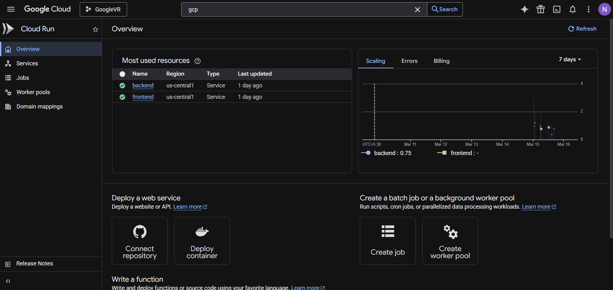
</p>
<p align="center"><em>Both <strong>frontend</strong> and <strong>backend</strong> services are healthy and running in <code>us-central1</code></em></p>

### Backend Service — Logs & Metrics
<table>
  <tr>
    <td width="50%">
      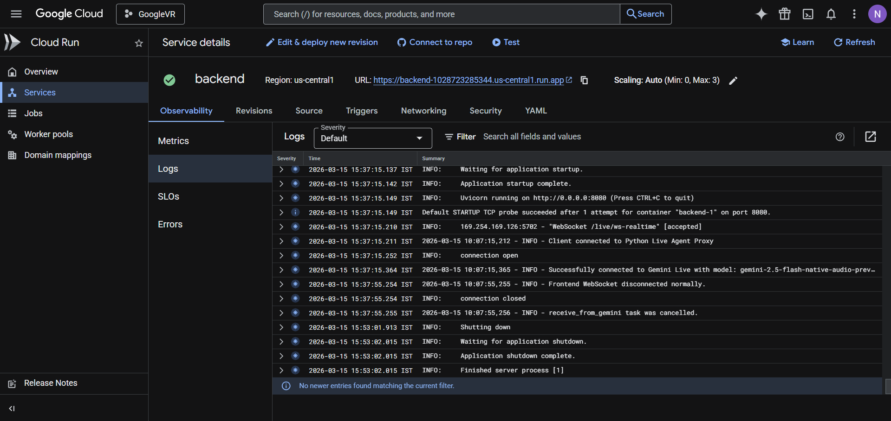
      <p align="center"><em>WebSocket connections to Gemini Live successfully established</em></p>
    </td>
    <td width="50%">
      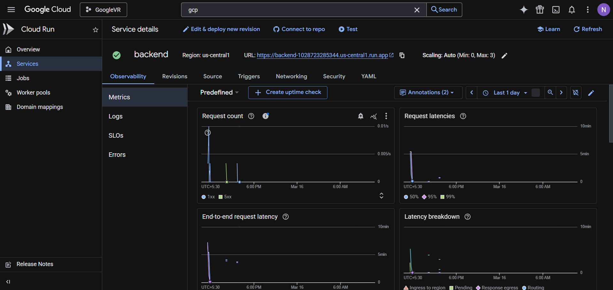
      <p align="center"><em>Request count, latency, and end-to-end performance metrics</em></p>
    </td>
  </tr>
</table>

### Frontend Service — Logs & Metrics
<table>
  <tr>
    <td width="50%">
      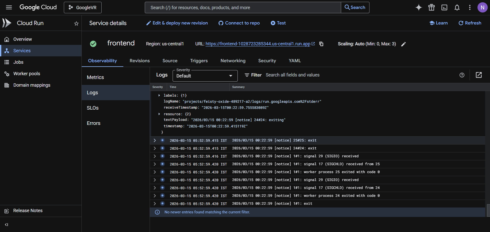
      <p align="center"><em>Nginx serving the React SPA with proper routing</em></p>
    </td>
    <td width="50%">
      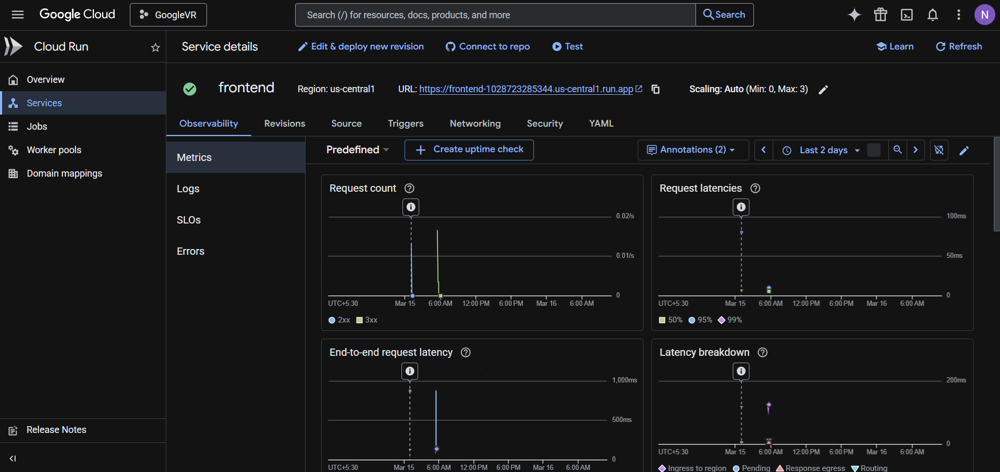
      <p align="center"><em>Sub-100ms latency serving static assets via Cloud Run CDN</em></p>
    </td>
  </tr>
</table>

### Gemini API Integration
<p align="center">
  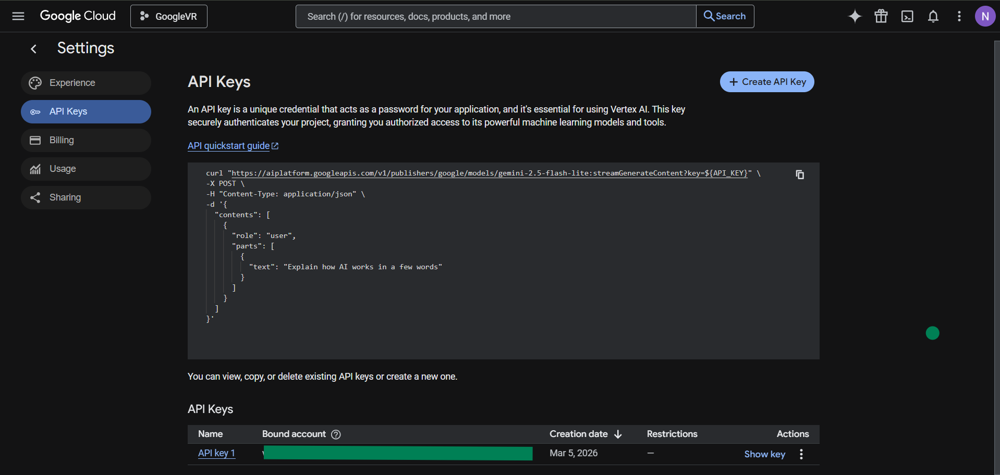
</p>
<p align="center"><em>Vertex AI API key configured for Gemini 2.5 Flash & Pro models</em></p>

---

## 📈 Key Findings & Learnings

| # | Insight | Impact |
|:---:|:---|:---|
| 1 | **Sub-second visual-to-audio latency** with Gemini 2.5 Flash Live API | Makes the AI tutor feel **human** — critical for engagement |
| 2 | **Visual heartbeats** (2-sec camera snapshots) build context proactively | AI suggests learning paths **without** the user asking "What is this?" |
| 3 | **Spatial mapping via UMAP** of embeddings reduces cognitive load | Learners visualize conceptual "distance" — solving the *"where was I?"* problem |
| 4 | **Manim + Gemini Pro** combo enables on-the-fly educational animations | No pre-rendered content needed — every explanation is **unique** |
| 5 | **Hand gesture detection** via camera makes VR accessible | No expensive controllers — just a phone and Google Cardboard |

---

## 🎤 Try These Live Prompts

Experience the full depth of NeuroGraph LIVE with these multimodal prompts:

### 1. 📖 Proactive Knowledge Mapping
> *"I'm looking at this page about Gradient Descent. Can you read this and add it to our map?"*

**What happens:** The AI Tutor analyzes your camera feed, extracts key concepts, and calls `create_mind_map`. It explains the new nodes and their connections to your existing graph.

### 2. 🔍 Deep-Dive Mind Map Exploration
> *"Can you explain this mind map in full depth? Show me how 'Backpropagation' connects to 'Neural Networks' and why it matters."*

**What happens:** The AI Tutor performs a semantic deep-dive, describing relationships and links qualitatively, helping you synthesize the entire topic.

### 3. 🎬 On-Demand Visual Learning
> *"This concept is abstract. Can you generate an animation explaining how the weights are updated?"*

**What happens:** The AI triggers the **Manim Engine** via `generate_video`. You receive a custom educational animation with live narration from your tutor.

### 4. 🌐 Multilingual Learning
> *"¿Puedes explicarme las redes neuronales en español?"* / *"নিউরাল নেটওয়ার্ক সম্পর্কে বাংলায় বলো"*

**What happens:** The AI responds fluently in the requested language, generating concept maps with localized labels.

---

## 🏗️ Reproducibility: Spin-Up Instructions

### Prerequisites
- Python 3.12+, Node.js 20+, FFmpeg (for Manim)
- A Google Cloud project with Gemini API access

### 1. Clone & Setup Backend
```bash
git clone https://github.com/your-repo/neurograph-live.git
cd neurograph-live

# Backend
cd app
pip install -r requirements.txt
# Create .env with your GEMINI_API_KEY
echo "GEMINI_API_KEY=your_key_here" > .env
uvicorn main:app --reload
```

### 2. Setup Frontend
```bash
cd frontend
npm install
npm run dev
```

### 3. 🚀 One-Click GCP Deployment
We provide a **fully automated deployment script** that handles everything:

```bash
chmod +x deploy-gcp.sh
./deploy-gcp.sh
```

**The script automatically:**
1. ✅ Enables required Google APIs (Cloud Run, Cloud Build, Artifact Registry)
2. ✅ Creates an Artifact Registry Docker repository
3. ✅ Builds & deploys the **Backend** to Cloud Run
4. ✅ Injects the Backend URL into `VITE_API_URL`
5. ✅ Builds & deploys the **Frontend** to Cloud Run
6. ✅ Returns your **live Frontend URL** 🎉

---

## 📁 Project Structure

```
neurograph-live/
├── app/                          # 🐍 Python Backend (FastAPI)
│   ├── main.py                   #   WebSocket server & API routes
│   ├── gemini_live_agent.py      #   Gemini 2.5 Flash Live integration
│   ├── manim_generator.py        #   Dynamic Manim animation engine
│   ├── requirements.txt          #   Python dependencies
│   ├── Dockerfile                #   Backend container
│   └── .gcloudignore
├── frontend/                     # ⚛️ React Frontend (Vite)
│   ├── src/
│   │   ├── App.jsx               #   Main application
│   │   ├── components/           #   UI components
│   │   └── index.css             #   Styles
│   ├── Dockerfile                #   Frontend container
│   └── package.json
├── Img/                          # 🖼️ Screenshots & assets
├── GCP/                          # ☁️ GCP deployment proof
├── deploy-gcp.sh                 # 🚀 One-click deployment script
├── docker-compose.yml            # 🐳 Local multi-service setup
└── LICENSE                       # MIT License
```

---

## 📜 License

This project is licensed under the **MIT License**. See the [LICENSE](LICENSE) file for details.

---

<p align="center">
  
  <br/>
  <strong>NeuroGraph LIVE</strong>
  <br/>
  <em>Moving education from static chat to immersive spatial exploration.</em>
  <br/><br/>
  Built with ❤️ using <strong>Gemini 2.5</strong> &amp; <strong>Google Cloud</strong>
  <br/>
  for the <strong>Gemini Live Agent Challenge</strong>
</p>
